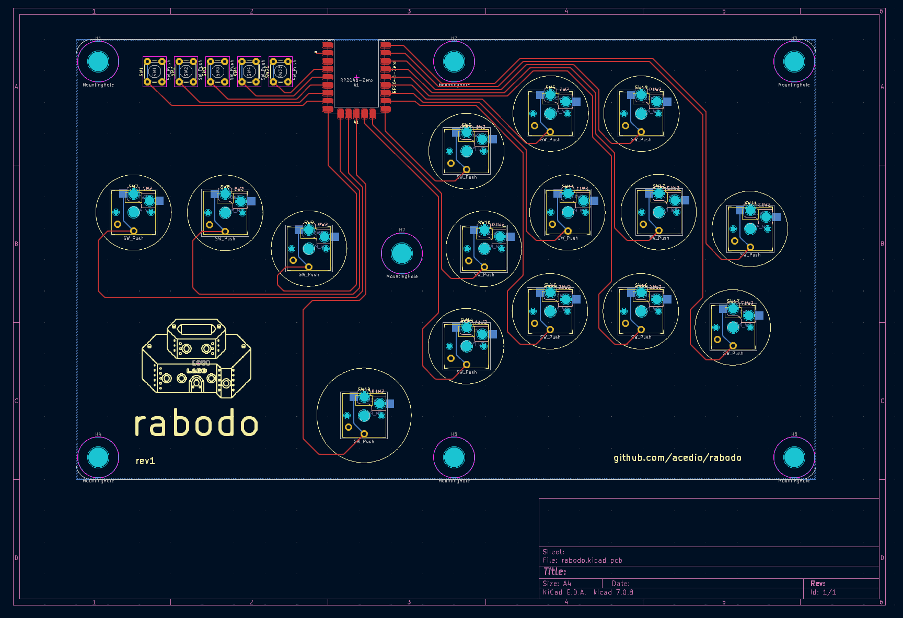

# rabodo (ラボード)

A leverless layout utilizing GP2040-CE. Planning to add a laser-cut
acryllic/wood case.

Intended to run GP2040-CE on the attached WaveShare RP2040-Zero.

## Acknowledgements and thanks!

PCB is based on the [Flatbox](https://github.com/jfedor2/flatbox) design,
specifically the Rev5. Also takes a lot of case inspiration from the
[Dural](https://github.com/BatiKING/DURAL_DIY) project! Thank you to jfedor2 and
BatiKING for your awesome work on these.

Also a huge thanks to all the contributors on the
[GP2040-CE](https://github.com/OpenStickCommunity/GP2040-CE) project! Excellent
firmware and community :D Special thanks to
[TheTrain](https://github.com/TheTrainGoes) for help reviewing the PCB before
printing!

PCB design licensed under CC BY-SA 4.0.

PCB design uses the following:

 - keyswitches.pretty by daprice (CC BY-SA 4.0)
     * Modified to add silkscreen where caps will go.
 - RP2040-Zero STEP file downloaded from Waveshare wiki
