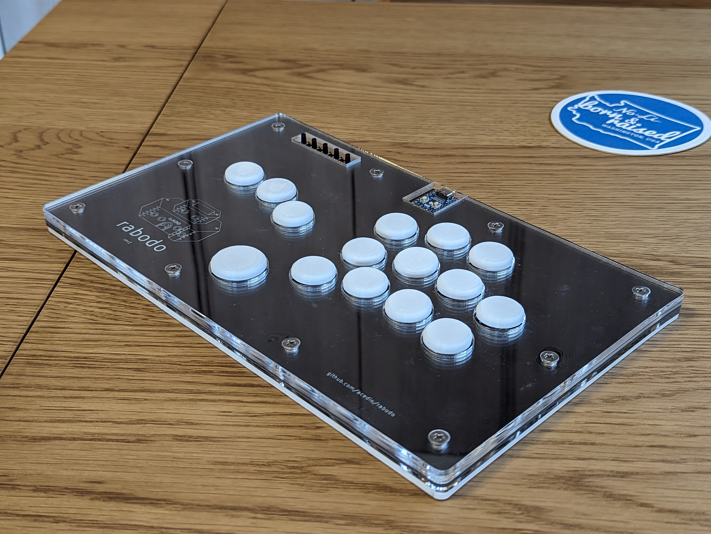

# rabodo (ラボード)

A leverless layout utilizing GP2040-CE. Planning to add a laser-cut
acryllic/wood case.

Runs GP2040-CE on the attached WaveShare RP2040-Zero.

## Assembly details

 - The PCB and case are designed to be held together with short (6mm) M4 screws
   and threaded heat-set inserts. The heat-set inserts are not actually melted
   into the acrylic, they were just the right form-factor for what I needed :)
 - I found 3mm acrylic was a good thickness for the top and bottom layers. The
   mid-layers on my final board were 3mm below the PCB and 4mm (2x2mm) above the
   PCB.
 - For the Kailh Choc V1 buttons, I've been experimenting with
   [these](https://www.printables.com/model/290182-arcade-button-caps-for-mx-and-kailh-low-profile-ke),
   but I'm finding it hard to keep them glued. I've not tried melting the PLA
   together yet, though, as I don't have a soldering tip I'm willing to
   sacrifice 😅
   [These](https://www.printables.com/model/176451-three-piece-flatbox-buttons-sturdier-prongs)
   seem like another promising option.

## Acknowledgements and thanks!

PCB is based on the [Flatbox](https://github.com/jfedor2/flatbox) design,
specifically the Rev5. Also takes a lot of case inspiration from the
[Dural](https://github.com/BatiKING/DURAL_DIY) project! Thank you to jfedor2 and
BatiKING for your awesome work on these.

Also a huge thanks to all the contributors on the
[GP2040-CE](https://github.com/OpenStickCommunity/GP2040-CE) project! Excellent
firmware and community :D Special thanks to
[TheTrain](https://github.com/TheTrainGoes) for help reviewing the PCB before
printing!

PCB and case design licensed under CC BY-SA 4.0.

PCB design uses the following:

 - keyswitches.pretty by daprice (CC BY-SA 4.0)
     * Modified to add silkscreen where caps will go.
 - RP2040-Zero STEP file downloaded from Waveshare wiki
