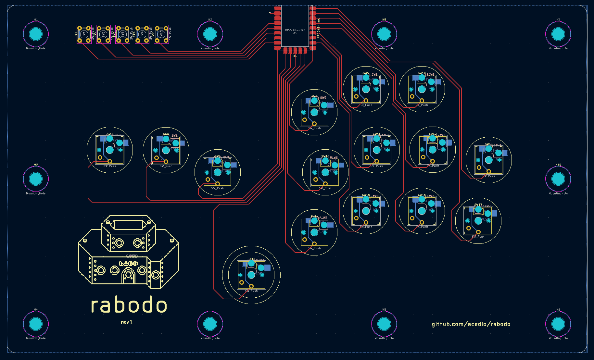

# rabodo (ラボード)

A leverless layout. Planning to add a laser-cut acryllic/wood case.

PCB is based on https://github.com/jfedor2/flatbox, specifically the Rev5
design. Also lots of inspiration from Dural
https://github.com/BatiKING/DURAL_DIY! Thank you to jfedor2 and BatiKING for
their awesome work on these.

PCB design licensed under CC BY-SA 4.0.

PCB design uses the following:

 - keyswitches.pretty by daprice (CC BY-SA 4.0)
     * Modified to add silkscreen where caps will go.
 - RP2040-Zero STEP file downloaded from Waveshare wiki
